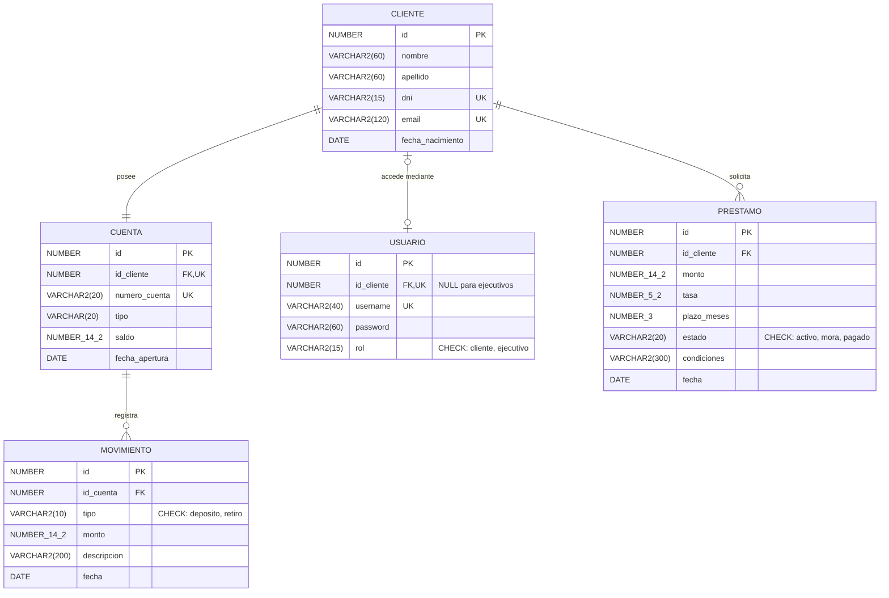

```mermaid
erDiagram
    CLIENTE ||--|| CUENTA : "posee"
    CLIENTE |o--o| USUARIO : "accede mediante"
    CLIENTE ||--o{ PRESTAMO : "solicita"
    CUENTA  ||--o{ MOVIMIENTO : "registra"

    CLIENTE {
        NUMBER id PK
        VARCHAR2(60) nombre
        VARCHAR2(60) apellido
        VARCHAR2(15) dni UK
        VARCHAR2(120) email UK
        DATE fecha_nacimiento
    }

    CUENTA {
        NUMBER id PK
        NUMBER id_cliente FK, UK
        VARCHAR2(20) numero_cuenta UK
        VARCHAR(20) tipo
        NUMBER_14_2 saldo
        DATE fecha_apertura
    }

    USUARIO {
        NUMBER id PK
        NUMBER id_cliente FK, UK "NULL para ejecutivos"
        VARCHAR2(40) username UK
        VARCHAR2(60) password
        VARCHAR2(15) rol "CHECK: cliente, ejecutivo"
    }

    PRESTAMO {
        NUMBER id PK
        NUMBER id_cliente FK
        NUMBER_14_2 monto
        NUMBER_5_2 tasa
        NUMBER_3 plazo_meses
        VARCHAR2(20) estado "CHECK: activo, mora, pagado"
        VARCHAR2(300) condiciones
        DATE fecha
    }

    MOVIMIENTO {
        NUMBER id PK
        NUMBER id_cuenta FK
        VARCHAR2(10) tipo "CHECK: deposito, retiro"
        NUMBER_14_2 monto
        VARCHAR2(200) descripcion
        DATE fecha
    }
```